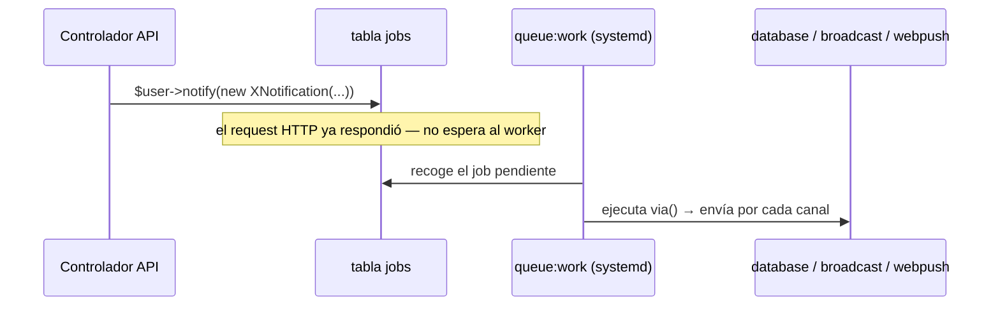
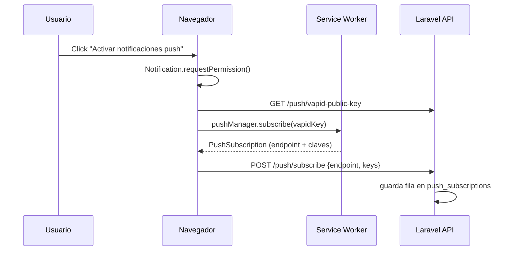
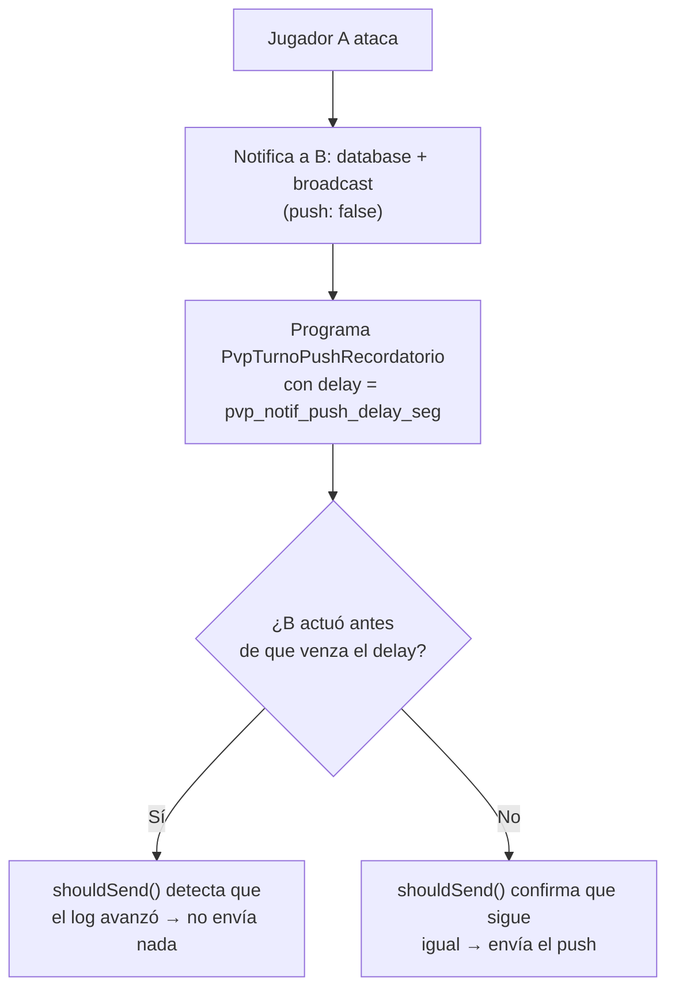

# NÉXUS — Sistema de Notificaciones (Pusher + Jobs + Web Push)

> Referencia de cómo funciona hoy el pipeline completo de notificaciones: desde que ocurre
> un evento en el juego hasta que aparece en la campanita, en el overlay de transmisión, o
> como notificación push en el celular. Incluye los incidentes reales encontrados en
> producción y qué cuidar a futuro.

---

## 1. Las tres piezas

Todo el sistema descansa sobre tres mecanismos independientes que casi siempre se disparan
**juntos**, pero cumplen roles distintos:

| Pieza | Rol | Cuándo se nota si falla |
|---|---|---|
| **Base de datos** (canal `database`) | Persiste la notificación en la tabla `notifications` — alimenta la campanita 🔔 y el drawer | El usuario no ve historial de notificaciones |
| **Pusher** (canal `broadcast`) | Empuja el evento en tiempo real por WebSocket mientras la pestaña está abierta — alimenta el overlay "TRANSMISIÓN ENTRANTE" | La app no reacciona en vivo; hay que refrescar para verlo |
| **Web Push** (canal `webpush`) | Empuja una notificación a nivel de sistema operativo — funciona con la pestaña cerrada o el celular bloqueado | No llega nada al celular, aunque adentro de la app todo funcione bien |

Estas tres piezas viven dentro de una sola **clase `Notification` de Laravel** por evento
(ver [§4](#4-catálogo-de-eventos-que-notifican)), cada una declarando en su método `via()`
a cuáles de los tres canales apunta.

```php
public function via(object $notifiable): array
{
    return ['database', 'broadcast', WebPushChannel::class];
}
```

---

## 2. El motor de entrega: la cola (jobs)

Las clases de notificación implementan `ShouldQueue`, por lo tanto **no se envían en el
mismo request** — Laravel las serializa como un `job` en la tabla `jobs` (driver
`QUEUE_CONNECTION=database`, el default de Laravel) y un **worker separado** los procesa.



**Esto es importante:** si no hay un worker corriendo, el `job` se queda en la tabla `jobs`
para siempre — no falla, no loggea nada, simplemente nunca se procesa. Así **ningún** canal
se ejecuta (ni siquiera `database`/`broadcast`).

### 2.1 Cómo correrlo en producción

El worker debe correr como proceso persistente y supervisado (no un `php artisan
queue:listen` colgado en una terminal SSH, que muere al cerrar sesión). Se configuró un
servicio `systemd` para esto.

```ini
# /etc/systemd/system/<nombre-del-servicio>.service
[Unit]
Description=Nexus Laravel Queue Worker
After=network.target

[Service]
User=ubuntu
WorkingDirectory=/var/www/nexus
ExecStart=/usr/bin/php artisan queue:work --sleep=3 --tries=3 --max-time=3600
Restart=always
RestartSec=5

[Install]
WantedBy=multi-user.target
```

```bash
sudo systemctl daemon-reload
sudo systemctl enable <nombre-del-servicio>
sudo systemctl start <nombre-del-servicio>
sudo systemctl status <nombre-del-servicio>
```

### ⚠️ Regla de oro: reiniciar el worker en cada deploy

`queue:work` es un **proceso PHP persistente** que carga el código una sola vez al
arrancar y lo mantiene en memoria (a diferencia de `queue:listen`, que sí recarga en cada
job). Si haces `git pull` con el worker corriendo, sigue ejecutando el código **viejo**
hasta que se reinicie — sin ningún error visible, simplemente ignora silenciosamente
cualquier canal/lógica nueva.

```bash
cd /var/www/nexus
sudo git pull
sudo npm run build
sudo php artisan migrate
sudo systemctl restart <nombre-del-servicio>   # ← el paso que se olvida
```

> Esto ya pasó una vez: se agregó el canal `webpush` a las notificaciones pero el worker
> viejo seguía corriendo, así que nunca se intentaba enviar push — cero logs, cero errores,
> simplemente silencio total.

---

## 3. Web Push en detalle

### 3.1 Piezas del lado del servidor

| Pieza | Ubicación | Rol |
|---|---|---|
| Paquete | `laravel-notification-channels/webpush` (composer) | Implementa el canal `WebPushChannel` |
| Claves VAPID | `.env` → `VAPID_SUBJECT`, `VAPID_PUBLIC_KEY`, `VAPID_PRIVATE_KEY` | Firman los mensajes push (identidad del servidor ante el navegador) |
| Tabla | `push_subscriptions` | Una fila por dispositivo/navegador suscrito (endpoint + claves públicas del navegador) |
| Trait | `App\Models\User` usa `HasPushSubscriptions` | `updatePushSubscription()`, `deletePushSubscription()`, `pushSubscriptions()` |
| Endpoints | `GET /api/push/vapid-public-key`, `POST /api/push/subscribe`, `POST /api/push/unsubscribe` | `PushSubscriptionController` |
| Trait compartido | `App\Notifications\Concerns\BuildsWebPushMessage` | Arma el `WebPushMessage` (title/body/icon/tag/url) a partir del mismo `toArray()` que ya arma la campanita — evita duplicar contenido por canal |

### 3.2 Piezas del lado del navegador (PWA)

| Pieza | Ubicación | Rol |
|---|---|---|
| Manifest | `public/manifest.json` | Metadata de instalación (nombre, íconos, `start_url`) |
| Service Worker | `public/sw.js` | Recibe el evento `push` del sistema operativo, muestra la notificación (`showNotification`) y maneja el click (`notificationclick` → enfoca/abre la pestaña en la URL indicada) |
| Registro + suscripción | `resources/js/push.js` | `registerServiceWorker()`, `subscribeToPush()`, `unsubscribeFromPush()` |
| Toggle de usuario | `NotifDrawer` en `resources/js/App.jsx` (componente `PushToggle`) | Botón "Activar notificaciones push" dentro del drawer de la campanita |
| Meta tags iOS | `resources/views/app.blade.php` | `apple-mobile-web-app-capable`, `apple-touch-icon`, etc. |

### 3.3 Flujo de suscripción



### 3.4 Fallos silenciosos — el segundo incidente real

El paquete `laravel-notification-channels/webpush` **no lanza excepción ni loggea nada**
cuando un envío falla (clave VAPID desincronizada, suscripción expirada, endpoint
inalcanzable, etc.) — solo dispara un evento (`NotificationChannels\WebPush\Events\NotificationFailed`)
que, sin un listener, se pierde en silencio.

**Ya se agregó un listener** en `app/Providers/AppServiceProvider.php` que deja registro en
el log:

```php
Event::listen(function (NotificationFailed $event) {
    Log::warning('Web push falló', [
        'endpoint'    => $event->subscription->endpoint,
        'status_code' => $event->report->getResponse()?->getStatusCode(),
        'reason'      => $event->report->getReason(),
        'expired'     => $event->report->isSubscriptionExpired(),
    ]);
});
```

Si un push no llega, **lo primero que hay que revisar** es:

```bash
grep -i "web push" storage/logs/laravel.log
```

---

## 4. Catálogo de eventos que notifican

Todas usan `ShouldQueue` + el trait `BuildsWebPushMessage` (salvo `MensajeRecibido`, que
usa su propio `toArray()` sin ese trait aún — ver nota).

| Notificación | Se dispara desde | Canales | Frecuencia |
|---|---|---|---|
| `DesafioRecibido` | `ChallengeController@challenge` | database, broadcast, webpush | Una vez por reto |
| `PvpCombatNotification` (reto/aceptar/rechazar/fin) | `PvpCombatController@challenge/accept/decline/action` | database, broadcast, webpush | Una vez por evento discreto |
| `PvpCombatNotification` (**"es tu turno"**, `push: false`) | `PvpCombatController@action` | database, broadcast **(sin push)** | Una vez por turno — ver [§5](#5-caso-especial-turnos-de-combate-pvp) |
| `PvpTurnoPushRecordatorio` | `PvpCombatController@action` (diferida) | webpush únicamente | Solo si no hubo respuesta a tiempo |
| `CombateResuelto` | `CombatController@resolve` | database, broadcast, webpush | Una vez al terminar un combate |
| `TradeNotification` | `TradeController@propose/accept/decline/cancel` | database, broadcast, webpush | Una vez por acción de intercambio |
| `TareaAsignada` | `TaskController@store` | database, broadcast, webpush | Una vez por tarea asignada |
| `MensajeRecibido` | `MessageController@send` | **webpush únicamente** | Una vez por mensaje directo |
| `TestTransmision` | `NotificationController@test` (widget "Probar Transmisión" del header) | webpush únicamente | Bajo demanda, para pruebas |

> `MensajeRecibido` no usa `database`/`broadcast` a propósito — los mensajes directos ya
> tienen su propio mecanismo de badge/polling (`GET /messages/unread`) independiente de la
> campanita, así que solo se le agregó el canal push para avisar cuando el usuario no está
> con la app abierta.

---

## 5. Caso especial: turnos de combate PvP

El primer intento fue notificar por push **cada** turno del combate ("es tu turno") — con
partidas activas esto generaba un push por cada intercambio de golpes, volviéndose spam
para alguien que está jugando activamente.

**Solución:** separar "avisar en vivo" (para la UI, sin push) de "avisar por push, pero
solo si de verdad no está atendiendo":



- **Config:** `pvp_notif_push_delay_seg` en la tabla `configuraciones` (editable desde el
  panel de Configuración, sección genérica de tablas), default **30 segundos**.
- **Verificación de vigencia:** `PvpTurnoPushRecordatorio::shouldSend()` vuelve a cargar el
  combate desde la base de datos al cumplirse el delay y compara la cantidad de entradas
  del `log` contra la que había al programar el recordatorio — si cambió, alguien ya actuó
  y se cancela el envío sin generar push.
- **UI:** `formatCombat()` expone `turno_desde` (timestamp de la última acción) y
  `notif_delay_seg`; `PvpCombatScreen.jsx` calcula una cuenta regresiva en vivo
  ("⏱ Ns antes de notificar") que se muestra debajo de cada card de personaje.

Este patrón (silencioso + recordatorio diferido con `shouldSend()`) es reutilizable para
cualquier otro evento que resulte demasiado ruidoso a futuro.

---

## 6. Incidentes reales de esta implementación (y cómo se resolvieron)

| # | Síntoma | Causa | Solución |
|---|---|---|---|
| 1 | Error de frontend `Cannot read properties of null (reading 'length')` al activar push | Las claves VAPID se generaron en el `.env` local pero `.env` está en `.gitignore` — nunca viajaron a producción | Ejecutar `php artisan webpush:vapid` **también en el servidor**; se agregó un check defensivo en `push.js` para dar un error legible en vez del `TypeError` |
| 2 | Push no llegaba y no había ningún log, ni de éxito ni de error | No había worker de cola corriendo en producción — los `jobs` se acumulaban sin procesarse nunca | Se creó el servicio `systemd` para `queue:work` |
| 3 | Al activar el worker por primera vez, 326 jobs atrasados se procesaron de golpe, mandando notificaciones viejas/obsoletas a los usuarios | Backlog acumulado desde antes de que el worker existiera | `php artisan queue:clear database --force` para vaciar backlog irrelevante; a futuro, ver [§7](#7-recomendaciones-a-futuro) sobre expiración de jobs viejos |
| 4 | Notificaciones push seguían sin llegar tras arreglar lo anterior, sin ningún log | El paquete de webpush falla en silencio por diseño (evento sin listener) | Se agregó el listener de `NotificationFailed` en `AppServiceProvider` (ver [§3.4](#34-fallos-silenciosos--el-segundo-incidente-real)) |
| 5 | Demasiadas notificaciones push durante un combate PvP activo | Cada turno disparaba push inmediato | Patrón silencioso + recordatorio diferido ([§5](#5-caso-especial-turnos-de-combate-pvp)) |

---

## 7. Recomendaciones a futuro

- **Monitoreo de la cola.** Hoy no hay alerta si el worker se cae o si `jobs` empieza a
  crecer sin procesarse — considerar `php artisan queue:monitor` + una alerta simple
  (cron que chequee `SELECT COUNT(*) FROM jobs` y avise si supera un umbral), o migrar a
  Laravel Horizon si el volumen crece.
- **Expiración de notificaciones viejas.** El incidente de los 326 jobs mostró que un
  backlog largo termina mandando contenido obsoleto. Se podría agregar un chequeo de
  antigüedad genérico (similar a `shouldSend()` de `PvpTurnoPushRecordatorio`) a las demás
  notificaciones — p. ej. no enviar push si el evento original ocurrió hace más de N horas.
- **Extensiones PHP.** El servidor no tiene `gmp` ni `bcmath` instalados — el firmado
  VAPID cae a una implementación PHP pura, más lenta. Instalar `php-bcmath` mejora el
  rendimiento (no es un bloqueante hoy, pero escala peor con más suscriptores).
- **`.env` es por servidor.** Cualquier secreto nuevo (VAPID, API keys, etc.) agregado
  localmente **no viaja con `git pull`** — hay que setearlo manualmente en cada entorno.
  Vale la pena mantener una checklist de variables de entorno "vivas" fuera del control de
  versiones.
- **Rotar secretos si se compartieron por error.** Durante el debugging de este sistema se
  pegó el `.env` completo de producción en un chat — si eso incluyó `DB_PASSWORD`,
  `PUSHER_APP_SECRET`, `MISTRAL_API_KEY` u otros, conviene rotarlos.
- **iOS/Safari.** El push solo funciona si el usuario agregó la PWA a la pantalla de
  inicio — no hay forma de evitar esta restricción de Apple, pero vale la pena comunicarlo
  en la UI (p. ej. un tip in-app para usuarios de iPhone).
- **Reinicio de worker post-deploy.** Automatizar el `systemctl restart` como parte del
  propio flujo de deploy (script o alias) para no depender de acordarse manualmente.

---

## 8. Checklist de despliegue (específica a este sistema)

```bash
cd /var/www/nexus
sudo git pull
sudo npm run build
sudo php artisan migrate            # nuevas tablas/configs (push_subscriptions, configuraciones, etc.)
sudo php artisan config:clear
sudo systemctl restart <nombre-del-servicio>   # ⚠️ el paso que más se olvida
```

Primer despliegue en un servidor nuevo, además:

```bash
sudo php artisan webpush:vapid       # genera VAPID_PUBLIC_KEY/VAPID_PRIVATE_KEY en el .env del servidor
sudo systemctl enable <nombre-del-servicio>
sudo systemctl start <nombre-del-servicio>
```
